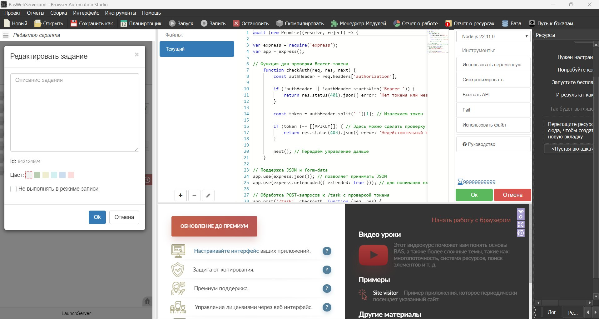
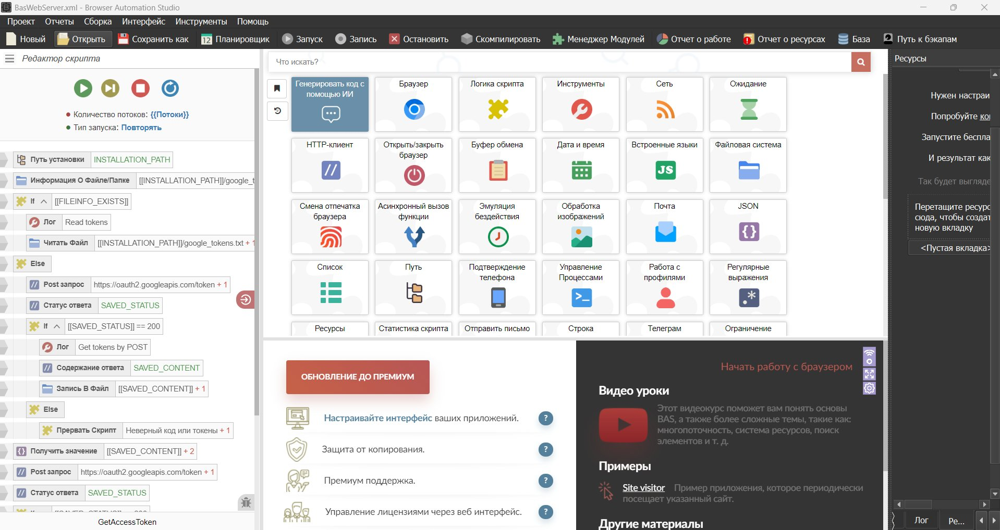

# Тема №36 — Веб-сервер на Express в BAS

> Как превратить BAS-скрипт в полноценный **веб-сервер на Express (Node.js)** прямо внутри BrowserAutomationStudio: приём задач по HTTP с авторизацией по токену и обработка их через браузерную автоматизацию.

**Проект:** [`BasWebServer.xml`](BasWebServer.xml) · **Уроков:** 12 · **Стек:** BAS + Express + Node.js 22.11.0 + Google Drive API

📄 [Техническое задание](technical-specification.md) — ТЗ, на базе которого создавался модуль.
📘 [Конспект уроков](lesson-plan.md) — пошаговый разбор всех 12 уроков с кодом.

[← Ко всем темам](../README.md)

## Что делает проект

BAS поднимает у себя HTTP-сервер на **Express**. Внешний сервис шлёт `POST /task` с **Bearer-токеном**, сервер проверяет токен и запускает сценарий браузерной автоматизации: поднимает профиль (отпечаток + прокси), прогревает куки, эмулирует активность, открывает сайт с формой и заполняет её, запрашивает код и картинку со стороннего сервера, грузит скриншот на Google Drive и отправляет ссылку с логом обратно через вебхук.

То есть BAS работает не как разовый скрипт, а как **постоянно слушающий сервер-воркер**, которым можно управлять по API.

## Структура проекта

| Функция | Назначение |
|---|---|
| `OnApplicationStart` | Инициализация при старте приложения |
| `LaunchServer` | Поднимает Express-сервер на порту `[[PORT]]`, проверка Bearer-токена (`checkAuth`), приём `POST /task` (JSON + form-data) |
| `LoadProfile` | Загрузка профиля: настройки отпечатка, мобильные и обычные прокси |
| `CookiesWarming` | Прогрев профиля куками |
| `EmulateActivity` | Эмуляция активности (человекоподобное поведение) |
| `LoadFormAndFill` | Открытие сайта с формой и её заполнение |
| `GetCode` | Запрос кода со стороннего сервера |
| `GetImageLink` / `DownloadImage` | Получение ссылки и загрузка изображения |
| `GetAccessToken` | Получение/обновление Google OAuth-токена (`oauth2.googleapis.com/token`) |
| `UploadScreenToDisk` | Загрузка скриншота на Google Drive (Drive API v3) |
| `SendScreenAndLogSuccess` | Отправка ссылки с логом на внешний сервер (вебхук) |

> Свои значения (токен `[[APIKEY]]`, порт, вебхуки, OAuth-данные Google) подставьте под свою инфраструктуру.

## Скриншоты

**Редактор скрипта — список функций модуля и палитра действий BAS:**

**Функция `LaunchServer` — код Express-сервера: проверка Bearer-токена, обработка `POST /task`:**

**Функция `GetAccessToken` — логика получения/обновления Google OAuth-токена:**

## Видеоуроки (12)

1. Подготовка инструментов
2. Подготовка ресурсов
3. Развертывание Express веб-сервера в BAS
4. Настройка архитектуры работы
5. Функция эмуляции активности
6. Функция прогрева профиля куками
7. Работа с профилями (отпечатки, мобильные и обычные прокси)
8. Запрос кода и изображения с другого сервера, обработка данных
9. Открытие сайта с формой, эмуляция активности, заполнение формы
10. Загрузка скриншота на Google Drive
11. Отправка ссылки с логом на сервер + финальная проверка + логирование
12. Компиляция скрипта и перенос на виртуальный сервер

> 🎬 [Плейлист всех 12 уроков на YouTube](https://www.youtube.com/playlist?list=PLihorGiCATBCSQWamPi1WO4LClUadoY9z)
